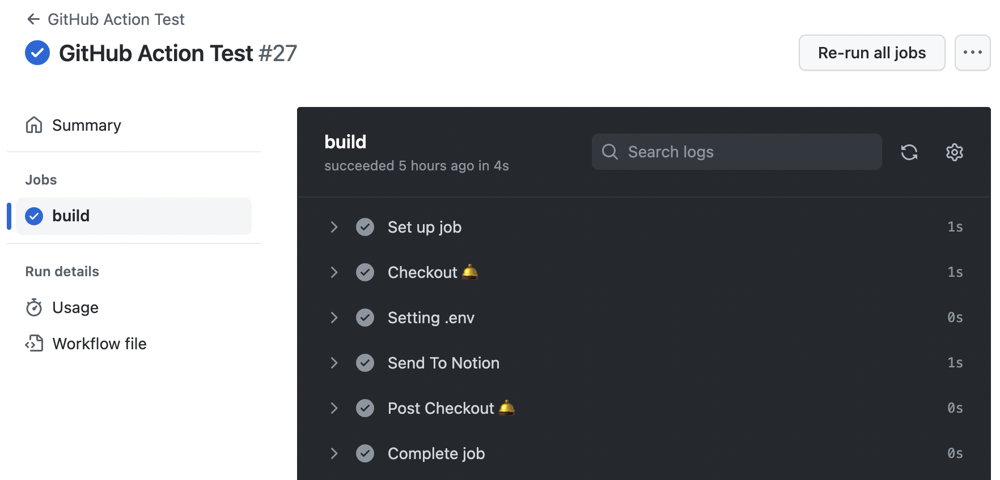
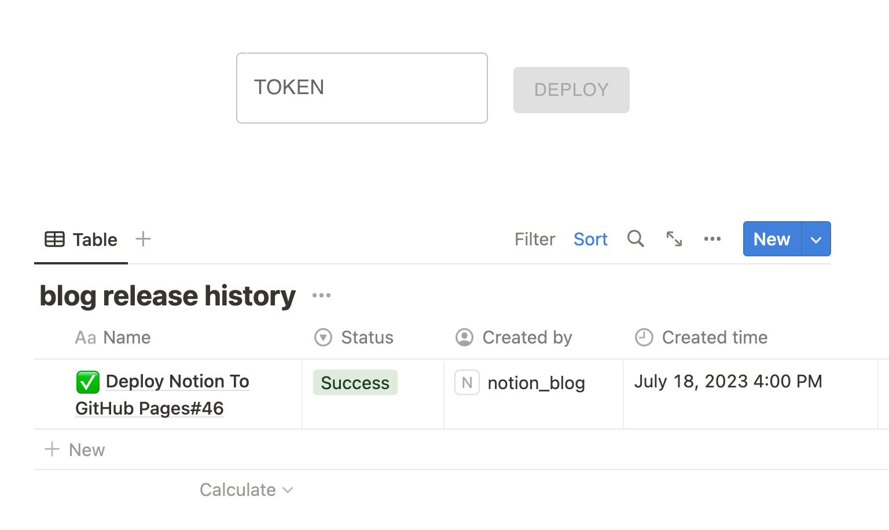

# NOTION TO GITHUB PAGES

|      Version      | Descrption | Example |
|------------------ | ---------- | ----------- |
| BASE_URL | base url for local development | http://localhost:3000 |
| NOTION_API_KEY | notion api secrets | secret_*** |
| NOTION_DATABSE_ID | database page id | **** |
| NOTION_HOMEPAGE_ID | main page id | **** |
| NOTION_HISTORY_ID | notification page id | **** |
| GA_TRACKING_ID |  | **** |
| GITHUB_REPOSITORY | github repository information | swimingkim/blog |
| COMMIT_EMAIL | github actions commit email | rumex13@naver.com |
| ANALYZE |  | false |

